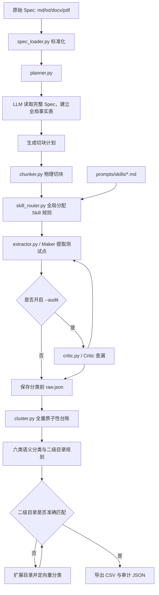

# 用户手册

这份手册面向两类用户：

- 使用者：拿一份 Spec，生成测试点 CSV。
- 验证知识维护者：维护 `prompts/skills/`，让工具更懂团队的协议、接口和验证经验。

如果你只是运行工具，先看第 1、2、4、5、6 节。如果你要理解项目基本架构或维护测试点生成质量，重点看第 3、7、8 节。

## 1. 这个项目做什么

DV Spec2Testplan Agent 用来把硬件 Spec 转成验证测试点列表。

输入：

- 标准 Markdown：`.md`、`.markdown`
- 非标准文本：`.txt`、`.text`
- Word 文档：`.docx`
- PDF 文档：`.pdf`

当前不直接支持网页 URL 或 HTML 文件。遇到网页 Spec 时，需要先保存或转换为 Markdown/文本文件，再作为输入。

输出：

- CSV 测试点表，包含分类、优先级、测试点摘要、详细描述、依据反标和二义性说明。

它适合生成初版 DV testplan，但不替代人工评审。验证工程师仍需要检查测试点是否有价值、是否覆盖完整、是否存在重复或误判。

## 2. 用户视角的项目结构

你通常只需要关心这几类文件：

| 你要做的事 | 主要看哪里 |
| --- | --- |
| 配置模型 | `.env`、`.env.example` |
| 运行工具 | `planner.py` |
| 输入适配 | `spec_loader.py` |
| 准备输入 | `example_spec.md` 或自己的 md/txt/docx/pdf Spec |
| 查看输出 | 生成的 `*.csv` |
| 维护验证经验 | `prompts/skills/*.md` |
| 调整全局提取纪律 | `prompts/layer1_meta.md`、`prompts/layer2_base.md` |
| 理解用户操作 | `README.md`、`docs/USER_MANUAL.md` |
| 交接给 AI/维护者 | `AI_HANDOFF.md` |

项目内部处理流程如下：



从用户角度看，`prompts/skills/` 是最重要的可维护部分。工具先从完整 Spec 确认 AXI、SRAM、ready、反压等协议或接口特征，再把对应验证经验分配到最合适的 Chunk。

## 3. 项目基本架构

### 3.1 Planner

入口文件是 `planner.py`。它负责：

- 读取 Spec。
- 调用大模型阅读完整 Spec，建立带原文证据的全局事实表。
- 生成切块计划，并把完整全局事实传给每个 Chunk。
- 调用全局 Skill 路由器分配规则。
- 调用 Maker/Critic/Cluster。
- 导出 CSV。

普通用户不需要改它，只需要运行它。

### 3.2 Backend

当前有两个后端：

- 默认后端：OpenAI-compatible API。老用户继续使用 `.env` 中的 API Key。
- 可选后端：Codex CLI。显式使用 `--backend codex` 时才启用。

后端只负责“怎么调用模型”，不应该改变测试点生成逻辑。

### 3.3 Input Adapter

`spec_loader.py` 是输入适配层。它负责把不同来源的 Spec 转成内部统一使用的标准 Markdown。

它当前支持：

- 标准 Markdown：直接读取，不重写标题。
- 非标准 `.txt`：根据 `1.`、`1.1`、`第一章`、`一、`、Setext 标题等规则恢复 Markdown 标题。
- `.docx`：读取 Word 标题样式、段落和表格，并转成 Markdown。
- `.pdf`：提取页面文本，再按文本标题规则恢复 Markdown 标题。

输入适配层只处理结构，不生成测试点。这样可以提升格式兼容性，同时不破坏原来的 Maker/Critic 生成质量。

如果控制台提示结构置信度为 `low`，通常表示章节识别不充分。建议先用 `--dump-normalized-spec` 导出中间文件，手动确认标题结构，再决定是否需要把原始文档整理成更清晰的 Markdown。

### 3.4 Maker

`extractor.py` 是 Maker，负责从每个文档块中提取测试点。它会组合四层 Prompt：

- `prompts/layer1_meta.md`：全局角色和提取纪律。
- `prompts/layer2_base.md`：通用验证原则和场景推演要求。
- `prompts/skills/*.md`：先由程序识别文档级候选，再由全局路由器分配到合适 Chunk 的协议经验。
- `schemas.py`：输出 JSON 结构要求。

### 3.5 Skill Router

`skill_router.py` 在物理切块完成后工作。它先根据完整 Spec 识别 AXI、SRAM、反压等候选 Skills，再让大模型结合全局事实和全部 Chunk，把每条规则分配给最合适的 Chunk。

它遵循两个原则：

- Spec 确认存在某类接口后，该接口的常规 DV 经验仍应得到覆盖，不要求 Spec 逐字写出。
- 同一规则默认只交给一个主要 Chunk；确有不同验证对象时才允许分配给多个 Chunk。

程序会校验所有候选规则是否都已分配，以及目标 Chunk 是否真实存在。漏分配或错误分配会明确报错，不会静默继续。

### 3.6 Critic

`critic.py` 是可选审计器。开启 `--audit` 后，它会检查 Maker 是否漏掉了原文中的硬件行为。

正式评审前建议开启。快速试跑可以关闭。

### 3.7 Cluster

`cluster.py` 不再只根据原始标签做关键词映射。它读取每条测试点的摘要、详细描述、依据反标、来源 Chunk 和完整 Spec 全局事实，完成四步处理：

1. 为每个内部测试点 ID 建立原子性台账，明确记录“拆分”或“保留”。
2. 在固定六个一级目录下规划有限、可复用的二级目录。
3. 逐点输出合法性、主验证意图、结果关注域、错误机制、corner 触发条件、分类理由和目录匹配依据。
4. 如果现有二级目录不准确，扩展 taxonomy，只重分受影响测试点。

固定一级目录是：

- 接口类
- 功能类
- 场景类
- 异常类
- 上报类
- corner类

六类业务边界如下：

| 一级目录 | 业务含义 |
| --- | --- |
| 接口类 | 信号、位宽、通道、握手和协议规定的正常接口交互 |
| 功能类 | Spec 支持范围内的正常功能，包括合法最小值、最大值和支持组合 |
| 场景类 | 多步骤、多接口或软件与硬件协作的完整流程 |
| 异常类 | 非法输入、不支持操作、越界、协议违规和错误响应 |
| 上报类 | 中断、状态、告警和其他可观察上报机制 |
| corner类 | 资源饱和、长停顿恢复、资源冲突、关键状态转换、多个合法极限条件叠加或多个独立错误机制的优先级交互 |

合法最高地址、合法最大 Burst、所有支持 ID 和合法 size/length 遍历不是 corner。随机反压是正常协议行为；长时间反压解除后的恢复才可能是 corner。首地址合法但后续 Burst beat 越界，主目的仍是单一地址错误处理，应归异常；同一请求同时命中非对齐和越界并验证错误优先级，才属于多错误机制交互的 corner。

原子性审查也不是机械拆句。测试点同时包含正常完成和错误响应，并且能按支持/不支持、范围内/范围外等客观刺激域切分时才拆分。即使具体支持边界、错误码或实现策略待澄清，只要刺激域客观可分，仍应拆开并在替代测试点中保留歧义；同一刺激究竟报错、切分还是由上游禁止等未决选择则保留为一条。每个输入 ID 必须在台账中出现一次，程序会拒绝漏审、重复、误拆和满足资格却未拆的结果。

## 4. 安装和配置

安装依赖：

```powershell
pip install -r requirements.txt
```

复制配置：

```powershell
copy .env.example .env
```

### 4.1 默认 API 模式

默认模式保持原版行为，使用用户提供的 OpenAI-compatible API Key。

`.env` 示例：

```env
DV_LLM_API_KEY="your_api_key_here"
DV_LLM_BASE_URL="https://api.deepseek.com"
DV_LLM_MODEL_NAME="deepseek-chat"
DV_SKILL_ROUTER="semantic"
DV_ATOMICITY_BATCH_SIZE="40"
DV_CLASSIFICATION_BATCH_SIZE="40"
DV_STRUCTURED_RETRY="2"
DV_CATEGORY_REPAIR_ROUNDS="2"
```

后四项通常保持默认值：分别控制原子性审查批次、分类批次、结构化输出纠正次数和二级目录自动扩展轮数。大文档或上下文较小的模型可以适当减小批次大小。

### 4.2 可选 Codex CLI 模式

Codex CLI 模式用于不外接 API、改用本机 Codex/ChatGPT 会员额度的场景。

一次性运行时直接加参数：

```powershell
python planner.py --backend codex --input example_spec.md --output out.csv --no-audit
```

长期使用时，可在 `.env` 中加入：

```env
DV_LLM_BACKEND="codex"
DV_CODEX_MODEL="gpt-5.5"
DV_CODEX_SANDBOX="read-only"
DV_CODEX_TIMEOUT_SEC="1800"
DV_CODEX_IGNORE_USER_CONFIG="1"
```

Codex CLI 不是默认模式，避免影响已有 API 用户，也避免无意消耗用户自己的 Codex 额度。

`DV_SKILL_ROUTER="semantic"` 是默认全局语义路由。需要兼容旧的逐 Chunk 路由时可设置为 `keyword`；该模式仍使用安全词边界，不会把普通单词内部的 `ram`、`ready` 当成协议关键词。

## 5. 怎么运行

交互式运行：

```powershell
python planner.py
```

命令行运行：

```powershell
python planner.py --input example_spec.md --output out.csv --audit
```

检查输入适配结果：

```powershell
python planner.py --input spec.docx --dump-normalized-spec normalized.md --normalize-only
```

只重跑原子性审查和分类，不重复运行 Maker/Critic：

```powershell
python planner.py --backend codex --classify-only --input out.raw.json --output out_reclassified.csv
```

`out.raw.json` 由完整运行自动生成。这个方式适合修改分类逻辑、六类业务定义或二级目录规则后做快速回归，也方便比较分类前测试点是否完全一致。

`normalized.md` 是工具真正送入后续切块和提取流程的标准 Markdown。对于 Word、PDF、非标准文本，建议先检查这个文件，确认章节识别是否合理。

如果输入来自网页，请先把网页正文保存成 Markdown 或文本文件。当前命令行参数只接受本地文件路径，不接受 `https://...` 这类 URL。

常用参数：

| 参数 | 说明 |
| --- | --- |
| `--input` / `-i` | 输入 Spec 路径，支持 md/txt/docx/pdf |
| `--output` / `-o` | 输出 CSV 路径 |
| `--backend openai` | 使用默认 API 后端 |
| `--backend codex` | 使用本机 Codex CLI 后端 |
| `--dump-normalized-spec` | 导出输入适配后的标准 Markdown |
| `--normalize-only` | 只执行输入适配并退出，不调用大模型 |
| `--dump-raw-testpoints` | 指定分类前测试点 JSON 的保存路径 |
| `--classify-only` | 把 `--input` 当作 raw testpoint JSON，只重跑分类和导出 |
| `--audit` | 开启 Critic 漏测审计 |
| `--no-audit` | 关闭 Critic，加快运行 |

建议：

- 快速验证链路：`--no-audit`
- 正式生成：`--audit`
- 大文档或多人协作：显式指定 `--output`

## 6. 输出 CSV 怎么看

输出文件使用 UTF-8 with BOM，通常可以直接用 Excel 打开。

| 列名 | 说明 |
| --- | --- |
| `测试点编号` | 自动生成的树状编号 |
| `一级分类` | 接口类、功能类、场景类、异常类、上报类、corner类等 |
| `二级分类` | 测试点子类 |
| `优先级` | `P0`、`P1`、`P2` |
| `特征标签` | Maker 提取的原始标签 |
| `测试点摘要` | 一句话测试目的 |
| `详细描述` | 测试行为、观察点或期望结果 |
| `依据反标` | 优先对应 Spec 原文；如果测试点来自 skill 经验且没有合适 Spec 原文，则反标到 skill 编号规则 |
| `存疑` | Spec 可能存在二义性时标记 |
| `缺陷/二义性说明` | 需要设计或架构澄清的问题 |
| `内部测试点ID` | 分类前后的稳定审计 ID；拆分项增加 `-S1`、`-S2` 后缀 |
| `分类置信度` | `high`、`medium`、`low` |
| `分类依据` | 结合完整测试意图和 Spec 合法范围给出的分类理由 |
| `混合意图说明` | 正常情况下为空；仍有混合意图时流程会停止导出 |
| `合法性判定` | 合法正常、已定义错误、非法/不支持或 Spec 待澄清 |
| `主验证意图` | 决定一级目录的结构化意图 |
| `结果关注域` | 最终要确认的是正常行为、单一错误、完整场景、上报、资源/状态交互还是多错误交互 |
| `错误机制` | 单一异常的主要错误机制，或多错误 Corner 中至少两个相互独立的错误机制 |
| `Corner触发条件` | 资源饱和、长停顿恢复、资源冲突、状态转换、多合法极限叠加或多错误优先级 |
| `Corner判定依据` | 只有 corner 项填写的可核查证据 |
| `二级目录匹配依据` | 当前测试点为何适合该二级目录 |

假设主输出是 `out.csv`，程序还会自动生成：

| 文件 | 内容 |
| --- | --- |
| `out.raw.json` | Maker/Critic 完成后、分类前的测试点和全局上下文 |
| `out.atomicity.json` | 每个原始 ID 的拆分/保留台账和资格判断 |
| `out.atomic.raw.json` | 原子性审查后的最终分类输入 |
| `out.classification.json` | 最终二级目录、逐点分类、合法性和 corner 证据 |

这些 JSON 是审计和复跑产物。普通用户不需要修改；排查“为什么被拆”“为什么进 corner”“为什么属于这个二级目录”时，应优先查看对应文件，而不是猜测 Prompt。

人工 review 时不要只看行数。更重要的是：

- 测试点是否有明确验证意图。
- 是否能反查到 Spec 原文或明确的 skill 规则。
- 是否覆盖核心路径、异常路径、边界条件和真实使用场景。
- “存疑”是否真的指向需要澄清的问题。
- 合法端点是否仍在功能类，非法越界是否在异常类。
- corner 是否有明确触发条件和证据，而不是只因为出现“最大、边界、交叉”等字样。
- `结果关注域` 是否符合测试点真正想确认的结果；单一错误机制不得包装成资源或状态交互。
- 二级目录名称是否与测试点主意图一致。

## 7. Skills 在哪里，怎么维护

Skills 是用户最应该维护的部分。

目录：

```text
prompts/skills/
```

当前已有：

```text
prompts/skills/axi.md
prompts/skills/sram.md
prompts/skills/backpressure.md
```

每个 skill 文件分三段：

```markdown
# keywords
触发这个 skill 的关键词

# explicit_rules
- AXI-EXP-001: 原文明确写到时必须提取的规则

# implicit_rules
- AXI-IMP-001: 即使原文没有直接写明，也应基于验证经验补充的测试点
```

### 7.1 keywords 怎么写

`keywords` 用来决定当前文档块是否挂载这个 skill。

示例：

```markdown
# keywords
axi, awvalid, arvalid, wvalid, rvalid, bvalid, awready, wready
```

建议：

- 写协议名、接口名、关键信号名。
- 中英文都可以写。
- 不要写过泛的词，例如 `data`、`valid`、`enable` 单独使用容易误触发。

### 7.2 explicit_rules 怎么写

`explicit_rules` 表示：如果 Spec 原文明确出现相关行为，必须提取测试点。

适合写：

- 协议限制。
- 明确边界。
- 明确错误响应。
- 明确时序要求。

示例：

```markdown
# explicit_rules
- AXI-EXP-001: 4KB 边界：如果原文描述 AXI burst 不允许跨越 4KB 边界，必须提取合法边界、跨界非法和错误响应测试点。
- AXI-EXP-002: 非对齐访问：如果原文描述地址必须 word 对齐，必须提取对齐访问和非对齐访问测试点。
```

不要写：

- “需要充分测试 AXI”这类空话。
- 没有触发条件、没有期望行为的泛泛建议。

### 7.3 implicit_rules 怎么写

`implicit_rules` 表示：只要文档块命中关键词，就允许模型根据验证经验补充测试点。

适合写：

- 反压。
- 背靠背。
- ID 覆盖。
- 读写冲突。
- 前门/后门一致性。
- 长时间 stall 后恢复。

示例：

```markdown
# implicit_rules
- AXI-IMP-001: 背靠背传输：当模块支持 AXI burst 或连续访问时，补充连续背靠背读写测试点。
- AXI-IMP-002: 通道反压：覆盖 AW/W/B/AR/R 各通道 ready 拉低和恢复后的数据不丢不重。
- AXI-IMP-003: AXI ID 覆盖：如果接口包含 ID，覆盖所有支持 ID 的读写事务。
```

注意：

- `implicit_rules` 权力很大，会让模型“脑补”测试点。
- 只写团队确实认可的验证经验。
- 不要把不确定的设计假设写成隐式规则。

### 7.4 skill 编号和依据反标

每条规则建议使用稳定编号：

```text
协议缩写-规则类型-三位序号
```

示例：

```markdown
- AXI-EXP-001: 4KB边界：提取 AXI Burst 传输跨越 4KB 地址边界时的报错或切分逻辑测试点。
- AXI-IMP-004: 通道反压：确保各通道在正常工作情况下，都触发过反压(ready拉低)。
```

编号的用途是让 CSV 反标可 review。工具生成测试点时遵循：

- 如果 Spec 里有能直接支撑测试点的句子，优先反标 Spec 原文。
- 如果测试点来自 skill 经验，且当前 Spec 没有合适原文支撑，则反标 skill 规则。
- 不应为了凑 Spec 反标，引用只包含弱相关关键词但不能说明测试意图的原文。

Skill 反标格式示例：

```text
[SKILL: axi.md#AXI-IMP-004] 通道反压：确保各通道在正常工作情况下，都触发过反压(ready拉低)。
```

### 7.5 新增一个 skill 的步骤

假设要新增 FIFO 相关经验：

1. 新建文件：

```text
prompts/skills/fifo.md
```

2. 写入结构：

```markdown
# keywords
fifo, full, empty, almost_full, almost_empty

# explicit_rules
- FIFO-EXP-001: 如果原文定义 FIFO full 行为，必须提取写 full 边界和 full 后继续写的异常测试点。
- FIFO-EXP-002: 如果原文定义 FIFO empty 行为，必须提取读 empty 边界和 empty 后继续读的异常测试点。

# implicit_rules
- FIFO-IMP-001: 指针回卷：覆盖读写指针接近最大值并回卷后的 full/empty 判断。
- FIFO-IMP-002: 同拍读写：覆盖同一周期读写同时发生时的计数和数据顺序。
```

3. 用包含 FIFO 章节的 Spec 试跑：

```powershell
python planner.py --input your_fifo_spec.md --output fifo_testplan.csv --no-audit
```

4. 检查 CSV：

- 是否出现 FIFO 相关测试点。
- 是否有无意义脑补。
- 依据反标是否能说明测试点来自 Spec 原文还是 skill 经验。

5. 正式生成时再开启审计：

```powershell
python planner.py --input your_fifo_spec.md --output fifo_testplan_audit.csv --audit
```

### 7.6 修改 skill 后怎么判断有没有改好

看三件事：

- 命中是否正确：该触发时触发，不该触发时不触发。
- 输出是否具体：测试点能看出测什么、为什么测。
- 依据反标是否可信：优先反标 Spec；Spec 不合适时应反标到具体 skill 编号。

不要用“输出越多越好”判断。skills 的目标是增加有效覆盖，不是制造行数。

## 8. 哪些文件不建议普通用户改

普通用户通常不要改：

- `schemas.py`
- `extractor.py`
- `critic.py`
- `cluster.py`
- `chunker.py`
- `codex_client.py`

这些文件是程序逻辑。改动它们可能导致 JSON 解析失败、分类异常或输出质量下降。

如果只是想让工具更懂某类协议，优先改 `prompts/skills/*.md`。

如果只是想调整测试点提取风格，优先讨论 `prompts/layer1_meta.md` 和 `prompts/layer2_base.md`，不要直接改 Python 逻辑。

## 9. 常见问题

### 未检测到 `DV_LLM_API_KEY`

默认后端是 API 模式。请检查 `.env` 是否存在，并填写：

```env
DV_LLM_API_KEY="your_api_key_here"
```

或者显式使用 Codex CLI：

```powershell
python planner.py --backend codex --input example_spec.md --output out.csv --no-audit
```

### Codex CLI 提示模型不支持

确认 `.env` 中的 `DV_CODEX_MODEL` 是当前账号可用模型。当前验证过的配置是：

```env
DV_CODEX_MODEL="gpt-5.5"
```

### 找不到 Codex CLI

确认 Codex 已安装并登录。必要时指定路径：

```env
DV_CODEX_EXE="C:\\Users\\yyou\\AppData\\Local\\OpenAI\\Codex\\bin\\codex.exe"
```

### CSV 被 Excel 占用

关闭正在打开的 CSV 后重试。程序遇到权限问题时会尝试生成备用文件名。

### 控制台中文乱码

通常是 Windows 控制台编码问题，不代表 CSV 文件损坏。CSV 使用 `utf-8-sig` 写入，Excel 通常可以正常识别。

### 只想调整分类，不想重新跑 Maker/Critic

使用完整运行生成的 `*.raw.json`：

```powershell
python planner.py --backend codex --classify-only --input out.raw.json --output out_reclassified.csv
```

分类前测试点和反标保持不变，便于只比较目录、合法性和 corner 判定。

### 为什么合法最大值没有放进 corner

合法最大值仍是 Spec 支持范围内的正常功能。corner 需要真实的资源饱和、长停顿恢复、资源冲突、关键状态转换或多个合法极限条件叠加。单一非法越界则属于异常。

### 为什么没有 `5.上报类`

一级目录含义固定，但当前 Spec 不一定包含中断、状态、告警等真正的上报机制。某个一级目录可以为空；普通 AXI OKAY/SLVERR 响应不会为了填满目录而被强行归入上报类。

## 10. 推荐工作流

维护一个协议 skill 时，建议按这个顺序：

1. 先用当前 skill 跑示例 Spec，保存 CSV。
2. 修改 `prompts/skills/*.md`。
3. 用同一个 Spec 再跑一次。
4. 对比新增、减少和变化的测试点。
5. 只保留能提升有效覆盖的规则。
6. 正式输出前开启 `--audit`。

这套工具的质量主要来自两点：

- Spec 原文是否写清楚。
- skills 是否沉淀了真实验证经验。

维护 skills 时要克制。具体、可验证、能指导测试的规则才应该进入知识库。

## 11. 自动化测试集

项目内自动化测试位于 `tests/`，不调用真实大模型，不消耗 API 或 Codex 额度。除输入适配外，还覆盖完整 Spec 全局事实、Skill 路由、六类分类、原子性台账、结构化纠错、二级目录扩展和编号连续性。

其中输入适配测试覆盖 14 个文档样本：

- 标准 Markdown。
- `1.` / `1.1` 编号标题文本。
- 中文 `第一章` 标题。
- 中文 `一、` 标题。
- Setext 标题。
- 全大写英文标题。
- 带列表项的文本，验证不会把普通 bullet 误判成标题。
- 带 Markdown 表格的文本。
- 无标题纯文本兜底。
- Word 标题样式文档。
- Word 纯段落编号文档。
- Word 表格。
- PDF 编号标题文本。
- PDF 无标题兜底。

分类相关单元测试还覆盖：合法最高地址归功能、非法越界归异常、单一跨界错误不能包装成 corner、多错误优先级保留 corner、真实多约束交互保留 corner、随机反压不误判 corner、需求未决但刺激域可分时仍纠正漏拆、原子性误拆自动纠正、未知二级目录自动扩展，以及空目录不造成编号跳号。

本地验证命令：

```powershell
python -m unittest discover -s tests
python -m compileall -q planner.py spec_loader.py codex_client.py extractor.py skill_router.py cluster.py critic.py schemas.py chunker.py
```
